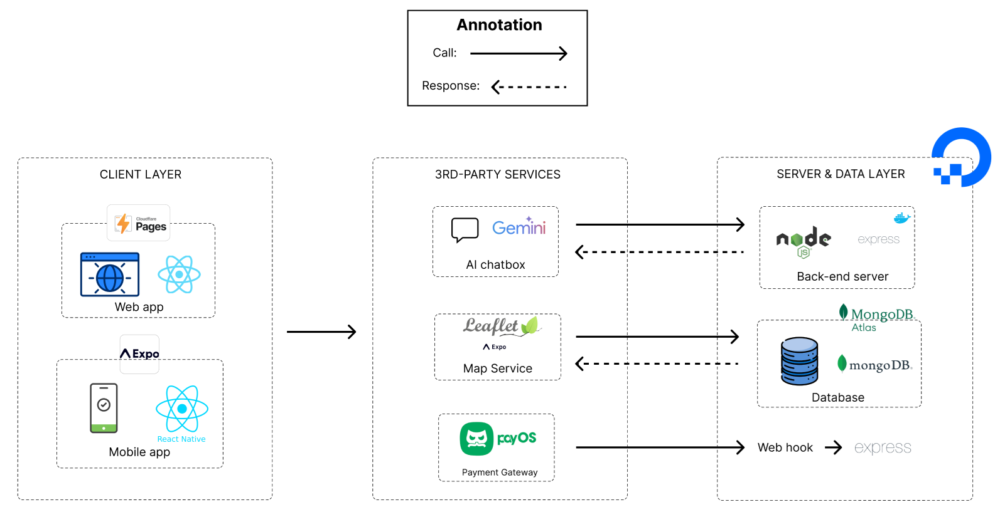
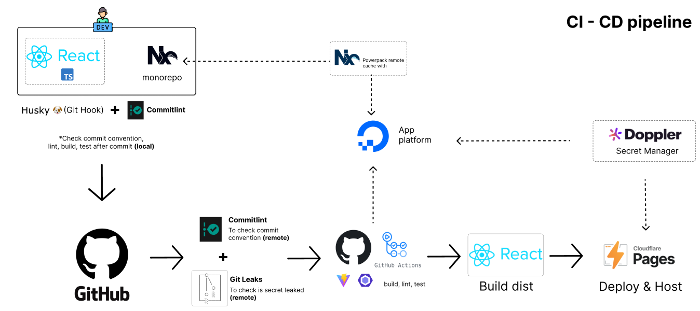

# Electric Vehicle Rental (Nx monorepo)

Electric vehicle rental web workspace built with Nx, React, and Vite. This monorepo hosts the front-end app for browsing EV stations, booking vehicles, handling payments, and visualizing fleet data with modern UI components.

## System Architecture Diagram (SAD)


## CI/CD pipeline


## Project overview
- Nx manages project graph, task orchestration, and caching across the workspace.
- `apps/fe-web-app`: React 19, React Router 7, TanStack Query, Tailwind/daisyUI, Radix primitives, drag-and-drop (dnd-kit), charts (Recharts), PayOS checkout.
- `apps/fe-web-app-e2e`: Cypress suite for smoke and end-to-end flows.
- Tooling: Vite bundler, ESLint + Prettier, Vitest, Husky + commitlint.
- Environment: configure `./.env` (`VITE_API_URL`, Doppler variables) for backend connectivity.

## Install and run
1. Prereqs: Node.js 20+ and npm 10+.
2. Install workspace dependencies:
   ```sh
   npm ci
   ```
3. Visualize the Nx project graph (optional):
   ```sh
   npx nx graph
   ```
4. Start the dev server:
   ```sh
   npx nx serve fe-web-app
   ```
5. Quality gates:
   ```sh
   npx nx lint fe-web-app
   npx nx test fe-web-app
   npx nx e2e fe-web-app-e2e
   ```
6. Production build:
   ```sh
   npx nx build fe-web-app
   ```
7. After code changes, prefer affected commands locally before pushing:
   ```sh
   npx nx affected:lint --base=origin/dev --head=HEAD
   npx nx affected:test --base=origin/dev --head=HEAD
   npx nx affected:build --base=origin/dev --head=HEAD
   ```

## Troubleshooting
- Port already in use: add `--port 4300` (or any free port) to the serve command.
- Env values not picked up: ensure variables start with `VITE_`, update `.env`, and restart the dev server.
- Unexpected build/test results: clear cache with `npx nx reset` and rerun the command.
- Dependency or node-gyp errors: confirm Node 20+, remove `node_modules`, run `npm cache clean --force`, then `npm ci`.
- CI failures: rerun the matching `nx affected:*` commands locally to reproduce issues with the same flags.
